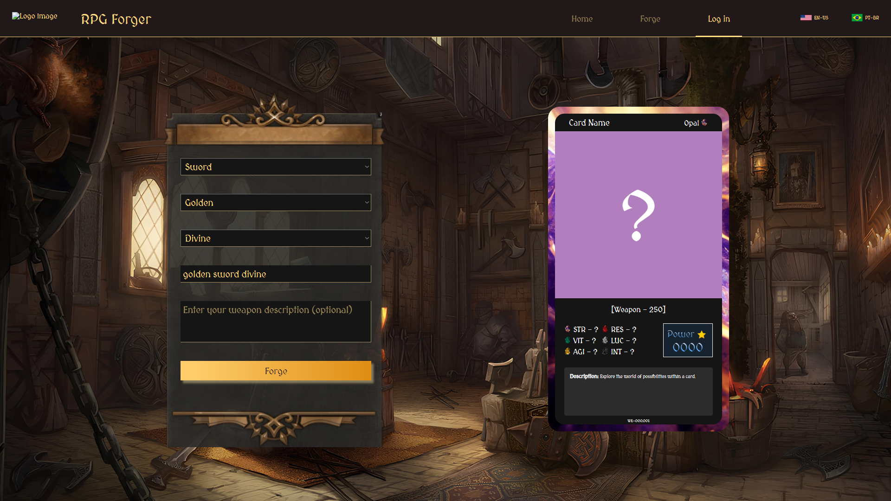
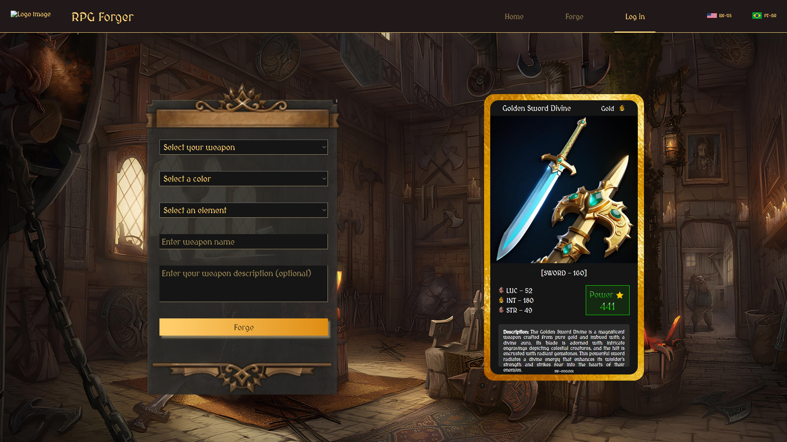

# RPG Forger
This project is an RPG card generator that connects to two APIs: Segmind and OpenAI.

The generated cards are divided into 3 categories: Weapon, Potion, and Armor. Each 
category has various different types, capable of generating a variety of unique items.

#### Card Forging Screen

#### Forged Card Result

<!--
Sumário
Instalação
Como usar
Contribuição
Licença
Instalação
Forneça instruções claras sobre como instalar e configurar o seu projeto. Inclua dependências e requisitos de sistema, se necessário.

# Exemplo de comandos de instalação
npm install
Como usar
Explique como os usuários podem utilizar seu projeto. Forneça exemplos de código e comandos para ilustrar.

bash
Copy code
# Exemplo de comandos de execução
npm start
Contribuição
Esclareça como outros desenvolvedores podem contribuir para o seu projeto. Forneça orientações sobre o processo de envio de pull requests e informe se há algum guia de estilo de código.

Faça um fork do projeto
Crie uma branch para sua feature (git checkout -b feature/nova-feature)
Faça commit das suas alterações (git commit -am 'Adiciona nova feature')
Faça push para a branch (git push origin feature/nova-feature)
Abra um pull request
Licença
Indique a licença do seu projeto. Certifique-se de escolher uma licença que seja apropriada para o seu projeto.

MIT License
-->