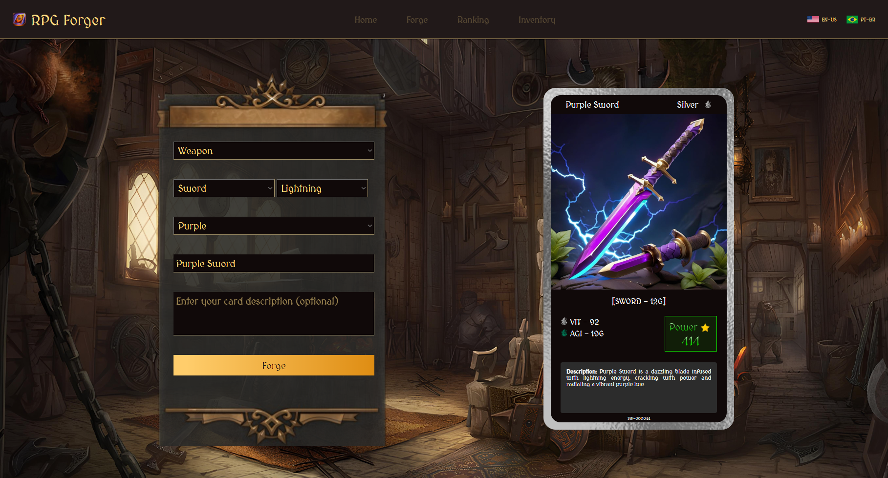
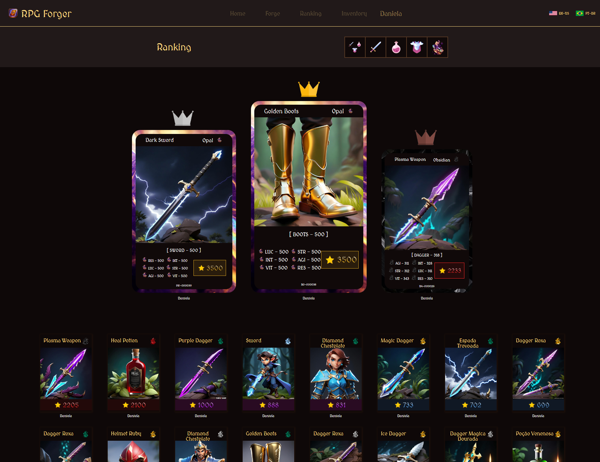

# RPG Forger 🚀
This project is an RPG card generator that connects to two APIs: Segmind and OpenAI.

The generated cards are divided into 3 categories: Weapon, Potion, and Armor. Each 
category has various different types, capable of generating a variety of unique items.

### Screenshot: Forged Card Result


### Screenshot: Inventory Cards


### Screenshot: Ranking Cards


### Video:
https://github.com/DanielaAlmeiida/django-ia-rpg/assets/104696916/8b29dabc-02a4-48ab-9722-dcf0a58199fd

## Dependências do Projeto 🛠️
```
annotated-types==0.6.0
anyio==4.2.0
asgiref==3.7.2
certifi==2023.11.17
charset-normalizer==3.3.2
colorama==0.4.6
distro==1.9.0
Django==5.0.1
h11==0.14.0
httpcore==1.0.2
httpx==0.26.0
idna==3.6
mysqlclient==2.2.1
openai==1.10.0
pillow==10.2.0
pydantic==2.5.3
pydantic_core==2.14.6
python-dotenv==1.0.1
requests==2.31.0
sniffio==1.3.0
sqlparse==0.4.4
tqdm==4.66.1
typing_extensions==4.9
```

# Comandos para execução do projeto ⚙️
```commandline
python manage.py runserver
```